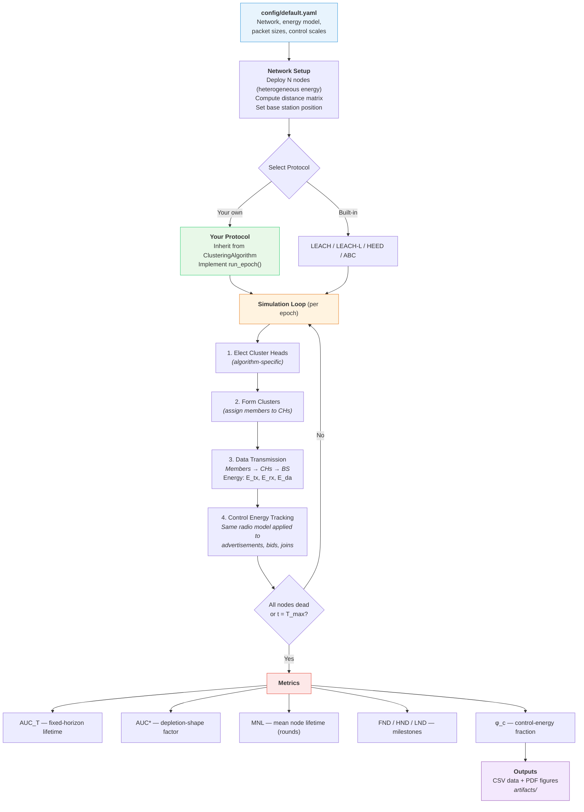

# WSN-Clustering-Benchmark

A simulation framework for benchmarking wireless sensor network (WSN) clustering protocols with explicit control-plane energy modeling.

The framework applies the same first-order radio model to control packets (advertisements, bids, join requests) as to data packets, enabling fair comparison of protocols with different coordination costs. It computes lifetime metrics (AUC_T, AUC\*, MNL, FND/HND/LND) and the control-energy fraction phi_c to expose regime-dependent protocol rankings.

## Framework Overview



## Implemented Protocols

| Protocol | Type | Reference |
|----------|------|-----------|
| **LEACH-L** | Probabilistic, local join | Heinzelman et al., HICSS 2000 |
| **LEACH** | Probabilistic, global join | Heinzelman et al., HICSS 2000 |
| **HEED** | Iterative, hybrid cost | Younis & Fahmy, IEEE TMC 2004 |
| **ABC** | Sealed-bid auction with fairness | *(this work)* |

## Installation

```bash
git clone https://github.com/<your-username>/WSN-Clustering-Benchmark.git
cd WSN-Clustering-Benchmark
pip install -r requirements.txt
```

**Requirements:** Python 3.10+, NumPy, SciPy, Matplotlib, Pandas, PyYAML, tqdm.

## Quick Start

### Reproduce all paper results (one command)

```bash
python reproduce.py          # Full run: simulations + figures (~30-60 min)
python reproduce.py --quick  # Figures only from existing data (~10 sec)
```

### Run a single protocol

```bash
python -m src.simulation --algorithm heed --trials 10
```

Available algorithms: `auction`, `heed`, `leach`, `leach-c`

### Run the full 2D workload sweep

This reproduces the paper's main experiment: 4 protocols x 4 payload sizes x 3 control scales x 10 trials.

```bash
python experiments/final_n100_experiment.py
```

Results are saved to `artifacts/` (CSV data and PDF figures).

### Run individual figure generators

```bash
# Winner maps (Figure 1)
python experiments/generate_single_winner_map.py
python experiments/generate_rtd_winner_maps.py

# Control-energy fraction line graph (Figure 2)
python experiments/generate_phi_c_line_graph.py
```

### Run a comparison experiment

```bash
python experiments/run_comparison.py --trials 15 --algorithms auction heed leach
```

## Metrics

| Metric | Description |
|--------|-------------|
| **AUC_T** | Area under the alive-node curve over a fixed horizon T, normalized by N x T |
| **AUC\*** | AUC normalized by LND (dimensionless depletion-shape factor) |
| **MNL** | Mean Node Lifetime = AUC\* x LND (rounds) |
| **FND / HND / LND** | First / Half / Last Node Dead milestones |
| **phi_c** | Control-energy fraction: ratio of control-plane energy to total energy spent |

## Configuration

All parameters are in `config/default.yaml`:

```yaml
network:
  num_nodes: 50
  area_width: 100.0
  area_height: 100.0
  bs_x: 50.0
  bs_y: 100.0
  comm_range: 30.0

energy:
  e_elec: 50.0e-9      # J/bit
  e_amp: 100.0e-12      # J/bit/m^2
  e_da: 5.0e-9          # J/bit
  initial_mean: 2.0     # J
  initial_std: 0.2      # J

control:
  enabled: true
  bits_multiplier: 1.0  # Scale factor for sensitivity testing
  discovery_radius_mode: local  # "local" or "global"
```

## Adding a New Protocol

1. Create `src/algorithms/your_protocol.py` inheriting from `ClusteringAlgorithm`:

```python
from src.algorithms.base import ClusteringAlgorithm

class YourProtocol(ClusteringAlgorithm):
    def setup(self):
        """One-time initialization."""
        pass

    def run_epoch(self):
        """Execute one clustering round. Must return a stats dict."""
        # 1. Elect cluster heads
        # 2. Form clusters (assign members)
        # 3. Simulate data transmission (consume energy)
        # 4. Use self.ctrl_unicast(), self.ctrl_broadcast_fixed(),
        #    self.ctrl_broadcast_to_set() for control messages
        alive = sum(1 for n in self.network.nodes if n.is_alive)
        return {
            'alive_nodes': alive,
            'control_energy_j': self.control_energy_j,
        }
```

2. Register it in `src/simulation.py`:

```python
from src.algorithms.your_protocol import YourProtocol
ALGORITHMS['your_protocol'] = YourProtocol
```

3. Run: `python -m src.simulation --algorithm your_protocol --trials 10`

The base class automatically tracks control-energy via `ctrl_unicast()`, `ctrl_broadcast_fixed()`, and `ctrl_broadcast_to_set()`. Call these for every control message your protocol sends to get accurate phi_c measurements.

## Project Structure

```
WSN-Clustering-Benchmark/
├── config/
│   └── default.yaml              # Simulation parameters
├── src/
│   ├── simulation.py             # Main simulation engine
│   ├── models/
│   │   ├── node.py               # Sensor node (agent) class
│   │   ├── network.py            # Network topology & distance matrix
│   │   ├── energy.py             # First-order radio energy model
│   │   ├── cluster.py            # Cluster formation logic
│   │   └── base_station.py       # Base station (sink)
│   ├── algorithms/
│   │   ├── base.py               # Abstract base with control-energy tracking
│   │   ├── auction.py            # ABC: Auction-Based Clustering
│   │   ├── heed.py               # HEED baseline
│   │   └── leach.py              # LEACH baseline (local & global modes)
│   ├── metrics/
│   │   └── collectors.py         # FND/HND/LND, AUC, energy logging
│   └── utils/
│       └── visualization.py      # Plotting utilities
├── experiments/                   # Experiment and figure generation scripts
├── artifacts/                     # Generated CSV data and figures
├── results/                       # Extended experiment outputs
├── config/default.yaml            # Default simulation parameters
├── requirements.txt
├── LICENSE
└── README.md
```

## Energy Model

The framework uses the first-order radio energy dissipation model:

```
E_tx(k, d) = E_elec * k + E_amp * k * d^2    (transmit k bits over distance d)
E_rx(k)    = E_elec * k                       (receive k bits)
E_da(k)    = E_DA * k                         (aggregate k bits)
```

Control messages (CH advertisements, bids, join requests, HEED iterations) use the same model with configurable packet sizes and broadcast radii. This prevents systematic underestimation of coordination overhead.

## Citation

If you use this framework in your research, please cite:

```bibtex
@inproceedings{wsn_clustering_benchmark,
  title     = {Control-Plane Energy Modeling for Fair WSN Clustering Evaluation},
  author    = {Zeng, Hao},
  booktitle = {IEEE VTC},
  year      = {2026}
}
```

## License

This project is licensed under the MIT License. See [LICENSE](LICENSE) for details.
